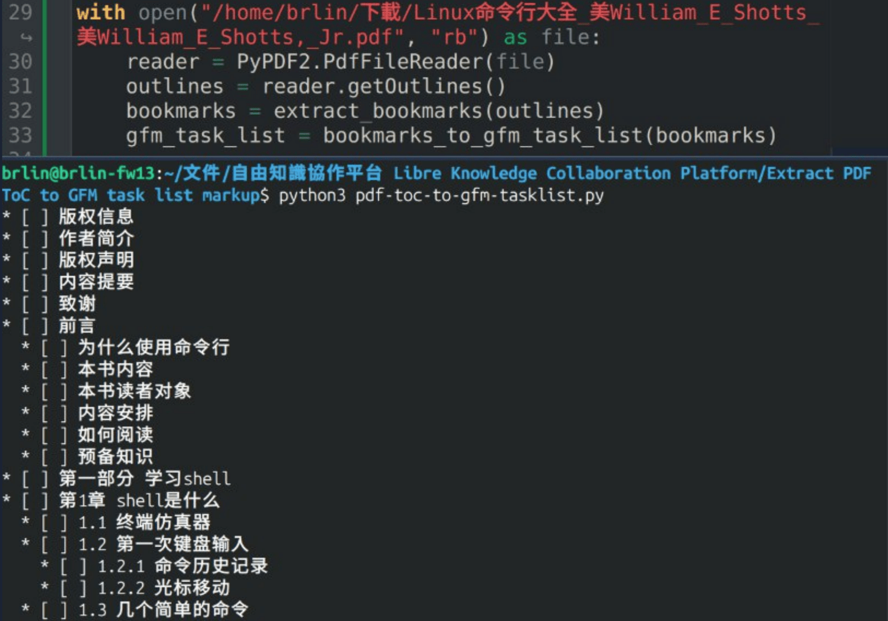

# PDF ToC to GFM tasklist

Extract the table of content(ToC) from a PDF document into a GitHub-flavored markdown(GFM) task list markup

<https://gitlab.com/brlin/pdf-toc-to-gfm-tasklist>  
[](https://gitlab.com/brlin/pdf-toc-to-gfm-tasklist/-/pipelines) [](https://github.com/brlin-tw/pdf-toc-to-gfm-tasklist/actions/workflows/check-potential-problems.yml) [](https://pre-commit.com/) [](https://api.reuse.software/info/gitlab.com/brlin/pdf-toc-to-gfm-tasklist)



## Prerequisites

Before running this software, the following prerequites must be satisfied:

* [Python](https://python.org)  
  The runtime environment, currently only tested on 3.11.  The `python3` compatibility executable must be available in your command search PATHs.
* A recent version of [PyPDF2](https://pypi.org/project/PyPDF2/)  
  The python library for operating the input PDF file, currently only tested on version 2.12.

## Usage

The following usage instructions assumes you are using a Unix-like operating system, instructions may not fully apply to other operating systems.

1. Download the release package from [the project's Releases page](https://gitlab.com/brlin/pdf-toc-to-gfm-tasklist/-/releases)
1. Extract the release package
1. Edit [the pdf-toc-to-gfm-tasklist.py Python program](pdf-toc-to-gfm-tasklist.py) using a text editor, edit [the `open()` call](https://gitlab.com/brlin/pdf-toc-to-gfm-tasklist/-/blob/da4e5abc1ad5be7c7a8e0a9824a1c4d18beef764/pdf-toc-to-gfm-tasklist.py#L29) to load the correct input PDF file to extract ToC from and save the file
1. Launch a text terminal application
1. Run the following command(with all the placeholder texts replaced) to switch the working directory to the extracted release package directory:

    ```bash
    cd /path/to/pdf-toc-to-gfm-tasklist-X.Y.Z
    ```

1. Run the following command to execute the ToC extraction utility, the converted ToC Markdown tasklist markup will be printed to the standard output device:

    ```bash
    ./pdf-toc-to-gfm-tasklist.py
    ```

   You may also use the I/O redirection functionality of your shell(e.g. Bash) to write the output to a file:

    ```bash
    ./pdf-toc-to-gfm-tasklist.py > toc.md
    ```

   Note that the I/O redirection syntax may be different for different shells, refer their user manual for more information.

Have fun!

## References

This section documents the third-party resources that this project has referenced:

* [PDF to GFM Conversion | ChatGPT](https://chat.openai.com/share/f51c809a-c0c5-4eee-babd-5f63ec13195b)  
  The discussion thread to render the utility prototype

## Licensing

Unless otherwise noted(individual file's header/[REUSE DEP5](.reuse/dep5)), this product is licensed under [version 3 of The GNU Affero General Public License](https://www.gnu.org/licenses/agpl-3.0.html), or any of its more recent versions of your preference.

This work complies to the [REUSE Specification](https://reuse.software/spec/), refer the [REUSE - Make licensing easy for everyone](https://reuse.software/) website for info regarding the licensing of this product.
